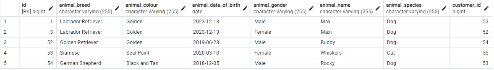
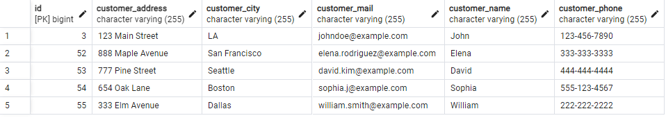
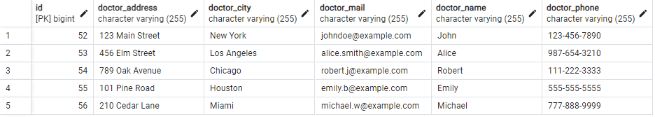
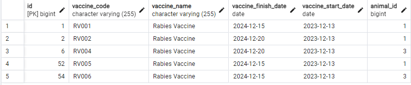
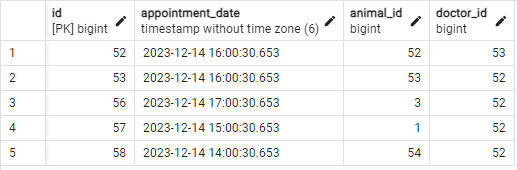

# Java Spring Boot - Veteriner Yönetim Sistemi Projesi

###  Bu proje Java ve Maven kullanılıp, katmanlı mimari göz önünde bulundurularak geliştirilmiş bir Rest API projesidir.

## Proje Mimarisinde:

- Entities
- Dto Request-Response
- Dao Repository Interface with JPA
- IoC, DI constructor injection
- Anatations (@Entity, @Table, @Id, @OneToMany, @ManyToOne, @ManyToMany)
- Fetch, Cascade Anatations
- Exceptions
- HTTP Response Status Codes (200-OK, 201-Created)
- Hibernate
- PostgreSQL

## UML Diyagramı

## End Points
### Bu proje http://localhost:8080 Port'u üzerinden çalışmaktadır. Alt tarafta bulunan End Point URL'lerini portun sonuna ekleyerek istek atabilirsiniz. Projenin içinde Swagger-ui eklidir. Dilerseniz http://localhost:8080/swagger-ui/index.html#/ adresinden tüm End Pointlere ulaşabilirsiniz.

## PostgreSQL Tabloları
### Tabloların örnekleri ver örnek verileri içerikte bulunmaktadır. Dilerseniz proje içerisindeki VetappSQL.sql dosyasını veritabanınıza Import'layarak bu verilere ulaşabilirsiniz.

